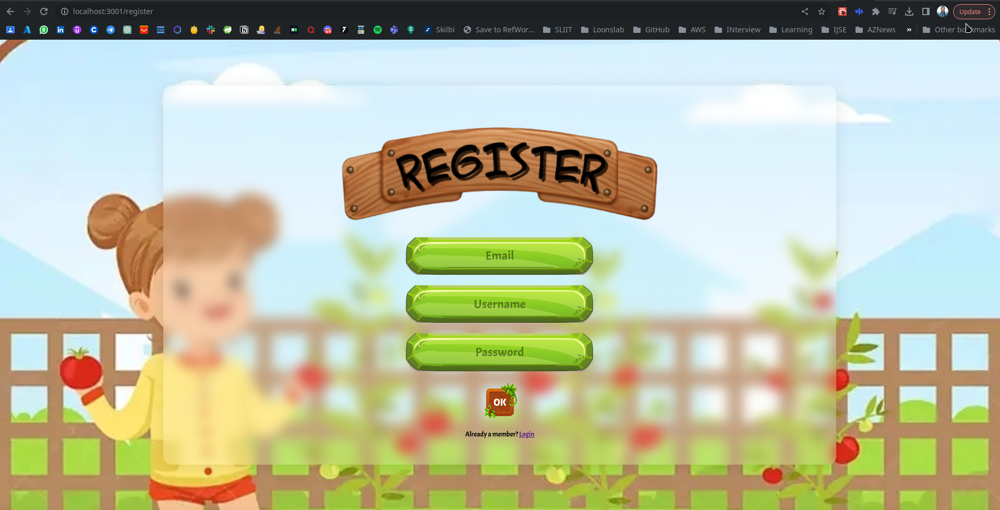
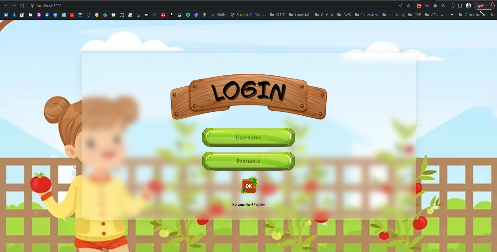
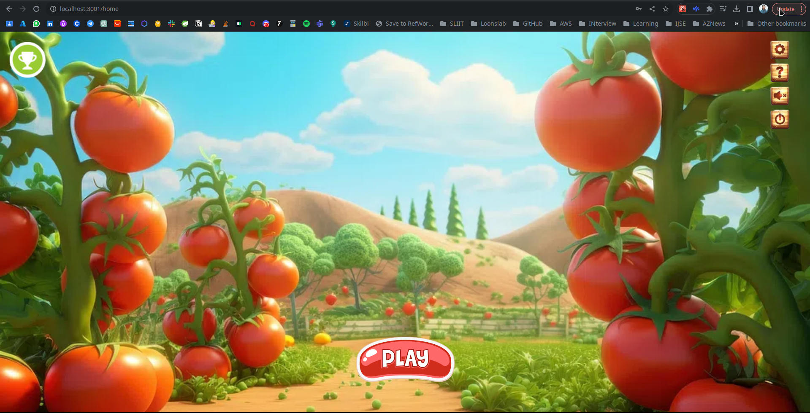
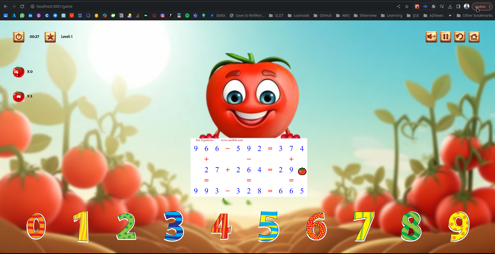
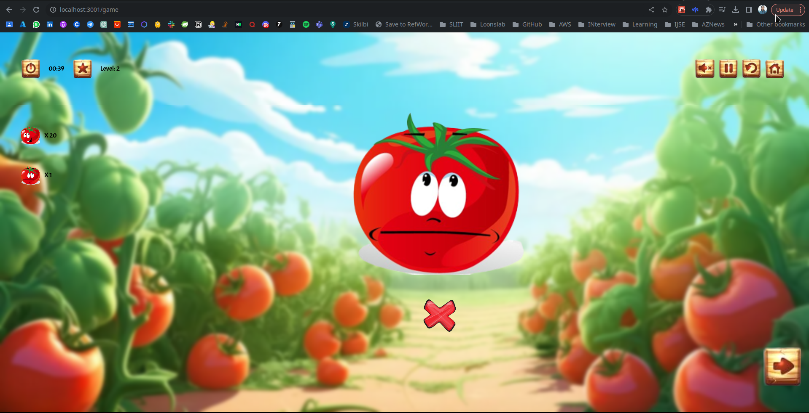
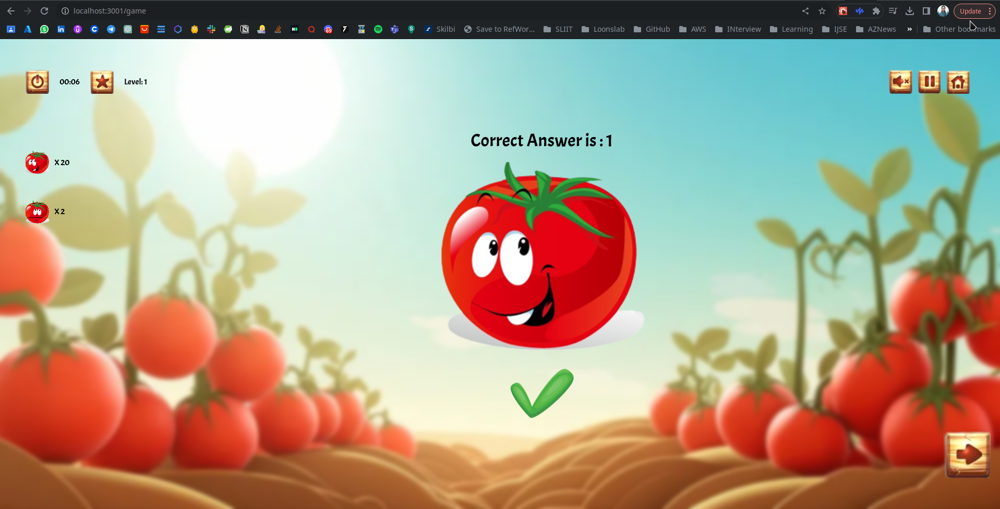
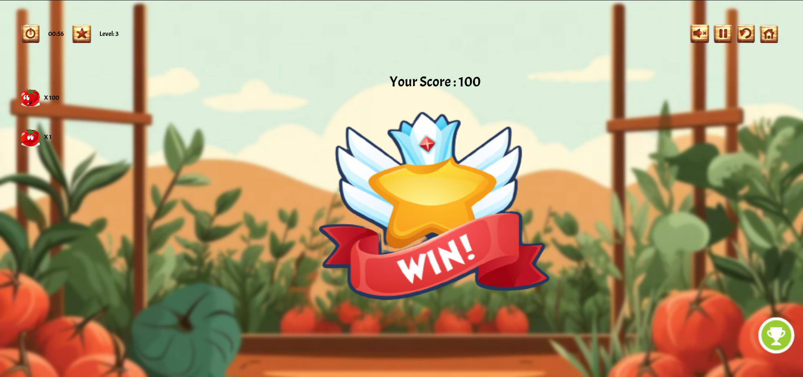
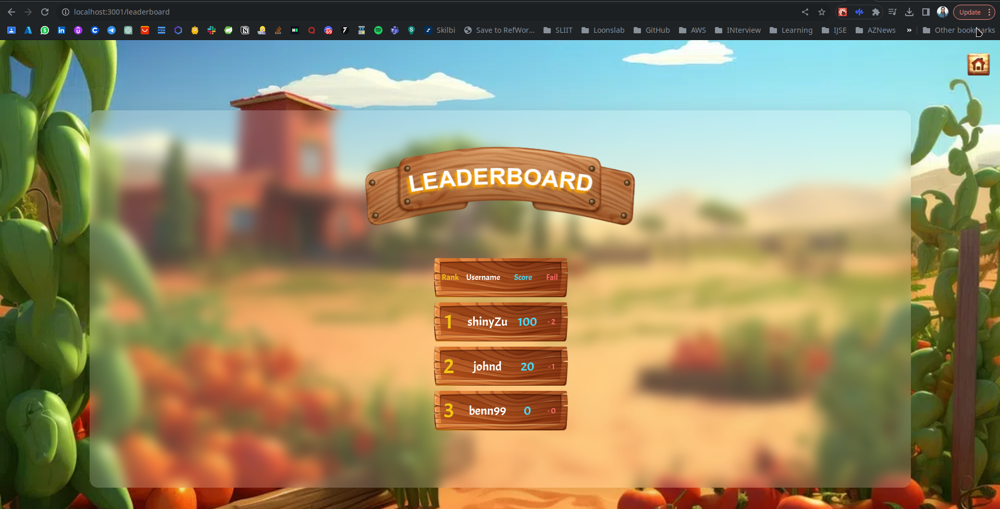
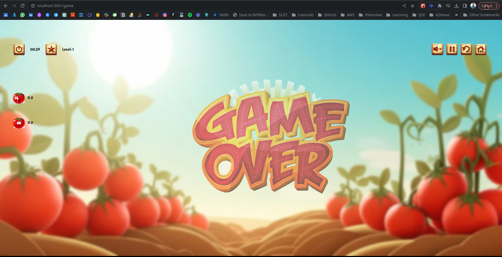

# TomatoQuest Game

 

### Assignment done under module Comparative Integrated Systems (CIS) in the final year at University of Bedfordshire.

 

## 4 themes implemented

 

1. Virtual Identity
2. Interoperability
3. Event-Driven Programming
4. Software Deisgn Principles
    - High Cohesion 
    - Low Coupling

 

## Technology Stack :

- Spring
- Maven
- MySQL
- React JS
- Axios
- MUI Components

 

## External APIs

- Tomato API

  

   
   
   
   
   
   
   
   
   